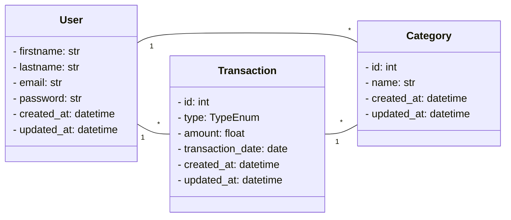

```mermaid
classDiagram
  direction LR
  class User {
    - firstname: str
    - lastname: str
    - email: str
    - password: str
    - created_at: datetime
    - updated_at: datetime
  }

  class Transaction {
    - id: int
    - type: TypeEnum
    - amount: float
    - transaction_date: date
    - created_at: datetime
    - updated_at: datetime
  }

  class Category {
    - id: int
    - name: str
    - created_at: datetime
    - updated_at: datetime
  }


  
  User "1" -- "*" Transaction
  User "1" -- "*" Category
  Transaction "1" -- "*" Category
```