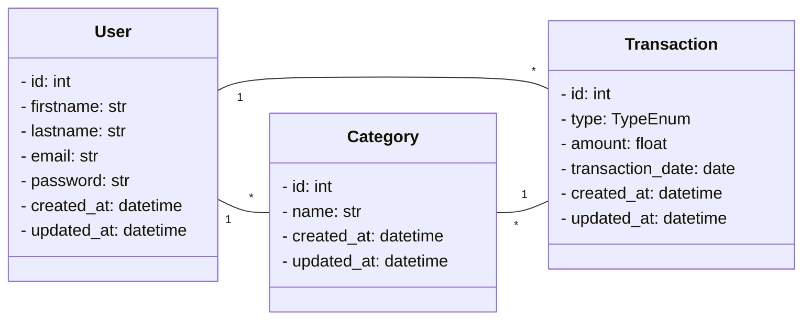

# Finance API

API **backend** para gerenciamento de **usuários, categorias e transações financeiras**, desenvolvida com **FastAPI** e **SQLModel**.
Permite registrar transações (**entradas** e **saídas**), organizá-las por categorias e gerenciar dados de forma segura com **autenticação JWT**.

---

## Diagrama de Classes



---

## 🛠️ Tecnologias Utilizadas

* **Python 3.11+** → linguagem principal do backend
* **FastAPI** → framework rápido e moderno para criação de APIs
* **SQLModel** → ORM que combina o poder do SQLAlchemy com a validação do Pydantic
* **PostgreSQL** → banco de dados relacional robusto e escalável
* **JWT (JSON Web Token)** → autenticação segura baseada em tokens
* **Pydantic** → validação e tipagem de dados eficiente
* **Docker & Docker Compose** → containerização e orquestração para padronizar ambientes

---

## 📂 Estrutura do Projeto

```bash
finance_api/
│── app/
│   ├── api/
│   │   ├── routes/           # Rotas organizadas por módulo
│   │   └── controller.py     # Registro central das rotas
│   ├── models/               # Modelos do banco de dados (SQLModel)
│   ├── schemas/              # Esquemas para validação (Pydantic)
│   ├── dto/                  # Data Transfer Objects (request/response)
│   ├── middleware/           # Middlewares (ex.: autenticação, erros)
│   └── main.py               # Ponto de entrada da aplicação FastAPI
│
│── requirements.txt          # Dependências do projeto
│── Dockerfile                # Configuração de container
│── docker-compose.yml        # Orquestração dos serviços
│── README.md                 # Documentação do projeto
```

---