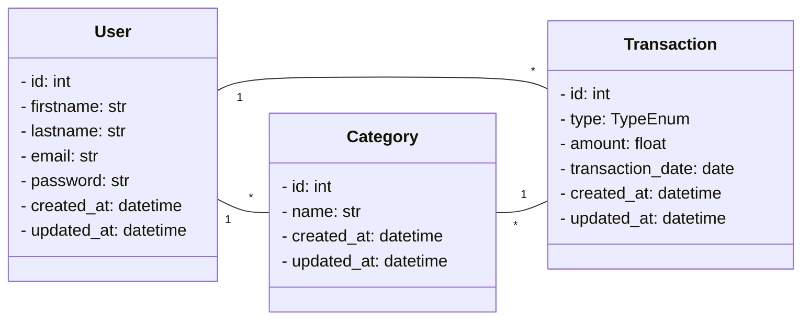

# Finance API

API backend para gerenciamento de **usuários, categorias e transações financeiras**, desenvolvida com **FastAPI** e **SQLModel**.  
Permite registrar transações (entrada/saída), organizar por categorias e gerenciar dados de forma segura com autenticação JWT.

---

## Diagrama de Classes


---

## Tecnologias

- **Python 3.11+** → Linguagem principal do backend  
- **FastAPI** → Framework web rápido e moderno para criação de APIs  
- **SQLModel** → ORM que combina o poder do SQLAlchemy com a validação do Pydantic  
- **PostgreSQL** → Banco de dados relacional robusto e escalável  
- **JWT (JSON Web Token)** → Autenticação segura e baseada em tokens  
- **Pydantic** → Validação e tipagem de dados de forma simples e eficiente  
- **Docker** → Containerização para padronizar o ambiente de desenvolvimento e produção  

---

## 📂 Estrutura do Projeto

```bash
project/
│── app/
│   ├── api/
│   │   ├── routes/          # Rotas organizadas por módulo
│   │   └── controller.py    # Ponto central para registro das rotas
│   ├── models/              # Modelos do banco de dados
│   ├── schemas/             # Esquemas para a validação com o Pydantic
│   ├── dto/                 # Data Transfer Objects (Pydantic/Response/Request)
│   ├── middleware/          # Middlewares (ex: autenticação, tratamento de erros)
│   └── main.py               # Arquivo principal da aplicação FastAPI
│
│── requirements.txt          # Dependências do projeto
│── Dockerfile                 # Configuração para containerização
│── docker-compose.yml         # Orquestração com Docker
│── README.md                  # Documentação do projeto

```